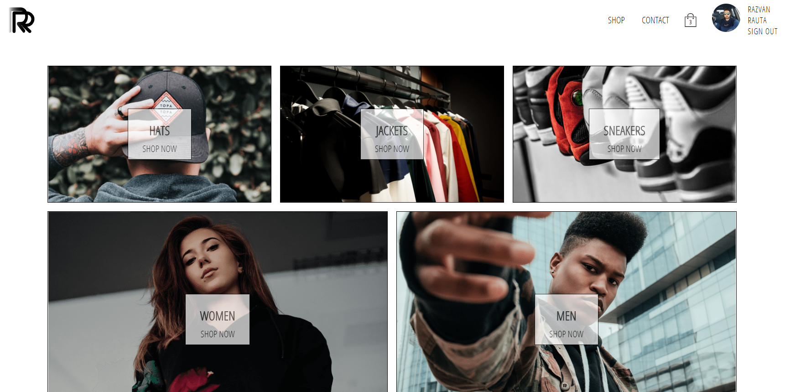

# Symfony React App

## Description

E-commerce app, made with Symfony, React, Redux and Redux Saga where React is running in Twig template.

## Live view

#### [https://rr-clothing.herokuapp.com](https://rr-clothing.herokuapp.com)

  

## Requierments
* php 7.3
* node-js
* yarn
* symfony-cli
* composer
* docker
* docker-compose

## Install

`composer install && yarn install`

## Run Project

`symfony run -d yarn dev-server && symfony server:start --port=80`

## Build project with docker

`docker-compose up --build -d`
